https://www.mermaidchart.com/play?utm_source=mermaid_mcp_server&utm_medium=remote_server&utm_campaign=cursor#pako:eNqVlN9v0zAQx_-VUx9QJzFVIPGSh0lbk62FrgtLBi-TJmPfOmueHexkIyD-d86N06Q_wiAvSeyP78f37vxrxI3AUTRy-L1CzTGWbGXZ060GegpmS8llwXQJyY8SmPMvtJopyExlObp9MOOWFWg93H5maJ8lx302PvPYEo2G1LhyZTH7vNjHTslh7aTz8OZ70OhpOl-D9BpkpkqiLlus-bvVDbc0JYJ59nE38UcQM6lq-n1AUSmE8Xs4vYSbfHrUnAjc8ckJyRPBLM9TuEhymISdhqK9Y0I2Rmf55WLyMbtakvmS7VraYF-YkoJRSG8gt0y7e2OfduH4LILpA_JHiKtCSe7xMYZS3UkR4mSqJLFfev72zcyXWXKdg_OLUq_uLLpKla7D47OtLLKKUxuEfVQOuxAOuejOPcqCUlqYVTiqxaAEX62khAh1MP4A91KhO9qvVtsZEaRopRGSU1MpRUk0ZLsfEs2SRTLNodKFNT4DFANJNwl31hfSlWDuYR4HQBlTwLmxkDD-ADedwU6Aw753_MG3mozuKt05zgK-U7-e7R5bWqrAqoaUlb4NaAUV8jBLP9G-cv4T1i_Gism5bS6GeoO9cnBqtJClpIm-sKYqNuofUCG0GgurQ63WS2qr19qGORjGv7VMM_hv6Q6I4Eofx_jEtIBrn7JrA2kYb9xT67GmKkye303a8oUw0nkLkduVr9OlFELhC7O4hwQf7XR7vcZpLehukvyoTw-3y3Z7NkZ761vOXGE0jebmAll7_K-4iWmUiGB9Z7U2W1GHZWJbjdNzl1hLQzMjyRXV4rBYvfQP98nf0h-KefT7D-L4QDY

Protego Health Backend - Architecture Diagram

## Comprehensive System Architecture

```mermaid
graph TB
    subgraph External["🌐 External Data Sources"]
        FDA["FDA DailyMed<br/>dailymed.nlm.nih.gov<br/>HTML Scraping"]
        CT["ClinicalTrials.gov<br/>clinicaltrials.gov/api/v2<br/>REST API"]
    end

    subgraph Container["🐳 Docker Container Layer"]
        subgraph ScraperService["📥 Scraper Service"]
            ScraperMain["main.py<br/>Service Orchestrator"]
            ScraperScheduler["DailyScheduler<br/>APScheduler<br/>Daily @ 2 AM UTC"]
            ScraperFactory["ScraperFactory<br/>🔧 Factory Pattern"]

            subgraph Scrapers["Scrapers"]
                FDAScraper["FDAScraper<br/>HTML Parser"]
                CTScraper["ClinicalTrialsScraper<br/>REST Client"]
            end

            ScraperRepo["ScrapingRepository<br/>📦 Repository Pattern"]
            ScraperLogger["ServiceLogger<br/>5 Log Files"]
        end

        subgraph AnalysisService["🔍 Analysis Service"]
            AnalysisMain["main.py<br/>Service Orchestrator"]
            AnalysisScheduler["AnalysisScheduler<br/>Periodic Polling"]
            AnalysisStrategy["AnalysisStrategy<br/>🎯 Strategy Pattern"]

            subgraph Analyzers["Analyzers"]
                KeywordAnalyzer["KeywordAnalyzer<br/>Frequency Analysis"]
                ConditionAnalyzer["ConditionGroupingAnalyzer<br/>Group by Condition"]
            end

            AnalysisRepo["AnalysisRepository<br/>📦 Repository Pattern"]
            ScrapingRepoRef["ScrapingRepository<br/>Read Reference"]
            AnalysisLogger["ServiceLogger<br/>5 Log Files"]
        end

        subgraph APIService["🚀 API Service (FastAPI)"]
            APIMain["main.py<br/>FastAPI App"]
            APIRoutes["Routers<br/>scraping_routes<br/>analysis_routes<br/>health_routes"]
            APIHandlers["Handlers<br/>Request Processing"]

            subgraph Middleware["Middleware Layer"]
                LoggingMW["LoggingMiddleware<br/>Request/Response Logging"]
                ErrorMW["ErrorHandlerMiddleware<br/>Exception Handling"]
                CORSMW["CORSMiddleware"]
            end

            APIRepos["Repositories<br/>ScrapingRepository<br/>AnalysisRepository"]
            APILogger["ServiceLogger<br/>5 Log Files"]
        end
    end

    subgraph Database["💾 Database Layer"]
        NeonDB[("Neon PostgreSQL<br/>Remote Database<br/>SSL Required")]

        subgraph Tables["Database Tables"]
            ScrapingTable["scraping_results<br/>- id, source_type<br/>- external_id, title<br/>- data, link<br/>- scraped_at"]
            AnalysisTable["analysis_results<br/>- id, scraping_result_id<br/>- analysis_type<br/>- keyword, frequency<br/>- metadata, created_at"]
        end
    end

    subgraph Logging["📋 Logging Infrastructure"]
        subgraph LogFiles["Service-Specific Logs<br/>services/{service}/logs/"]
            ErrorLogs["error.log<br/>Error Level"]
            InfoLogs["info.log<br/>Info Level"]
            DebugLogs["debug.log<br/>Debug Level"]
            WarningLogs["warning.log<br/>Warning Level"]
            AuditLogs["audit.log<br/>Audit Trail"]
        end

        LoggerFactory["LoggerFactory<br/>🏭 Factory Pattern<br/>JSON Format<br/>Log Rotation"]
    end

    subgraph Orchestration["☸️ Orchestration Layer"]
        DockerCompose["Docker Compose<br/>Local Development"]
        K8s["Kubernetes<br/>Production Deployment"]
        ConfigMap["ConfigMap<br/>Environment Variables"]
        Secrets["Secrets<br/>Database Credentials"]
    end

    subgraph Clients["👥 Clients"]
        WebBrowser["Web Browser<br/>Swagger UI<br/>http://localhost:8000/docs"]
        APIClient["API Clients<br/>REST API Consumers"]
        TestScript["Test Scripts<br/>./scripts/test-api.sh"]
    end

    %% External to Scraper
    FDA -->|HTTP GET<br/>HTML Response| FDAScraper
    CT -->|REST API<br/>JSON Response| CTScraper

    %% Scraper Service Flow
    ScraperScheduler -->|Trigger| ScraperMain
    ScraperMain -->|Create| ScraperFactory
    ScraperFactory -->|Instantiate| FDAScraper
    ScraperFactory -->|Instantiate| CTScraper
    FDAScraper -->|Scraped Data| ScraperMain
    CTScraper -->|Scraped Data| ScraperMain
    ScraperMain -->|Save| ScraperRepo
    ScraperRepo -->|INSERT| ScrapingTable
    ScraperMain -->|Log| ScraperLogger
    ScraperLogger -->|Write| LoggerFactory
    LoggerFactory -->|Generate| LogFiles

    %% Analysis Service Flow
    AnalysisScheduler -->|Trigger| AnalysisMain
    AnalysisMain -->|Read Unprocessed| ScrapingRepoRef
    ScrapingRepoRef -->|SELECT| ScrapingTable
    AnalysisMain -->|Select Strategy| AnalysisStrategy
    AnalysisStrategy -->|Use| KeywordAnalyzer
    AnalysisStrategy -->|Use| ConditionAnalyzer
    KeywordAnalyzer -->|Analyze| AnalysisMain
    ConditionAnalyzer -->|Analyze| AnalysisMain
    AnalysisMain -->|Save Results| AnalysisRepo
    AnalysisRepo -->|INSERT| AnalysisTable
    AnalysisMain -->|Log| AnalysisLogger
    AnalysisLogger -->|Write| LoggerFactory

    %% API Service Flow
    WebBrowser -->|HTTP Request| APIMain
    APIClient -->|HTTP Request| APIMain
    TestScript -->|HTTP Request| APIMain
    APIMain -->|Route| APIRoutes
    APIRoutes -->|Handle| APIHandlers
    APIRoutes -->|Process| LoggingMW
    LoggingMW -->|Log| APILogger
    APIRoutes -->|Catch| ErrorMW
    APIHandlers -->|Query| APIRepos
    APIRepos -->|SELECT/INSERT/UPDATE/DELETE| ScrapingTable
    APIRepos -->|SELECT/INSERT/UPDATE/DELETE| AnalysisTable
    APIRepos -->|SELECT| ScrapingTable
    APILogger -->|Write| LoggerFactory

    %% Database Connections
    ScraperRepo -.->|Async Connection| NeonDB
    AnalysisRepo -.->|Async Connection| NeonDB
    ScrapingRepoRef -.->|Async Connection| NeonDB
    APIRepos -.->|Async Connection| NeonDB
    NeonDB -->|Store| ScrapingTable
    NeonDB -->|Store| AnalysisTable

    %% Orchestration
    DockerCompose -.->|Orchestrate| ScraperService
    DockerCompose -.->|Orchestrate| AnalysisService
    DockerCompose -.->|Orchestrate| APIService
    K8s -.->|Deploy| ScraperService
    K8s -.->|Deploy| AnalysisService
    K8s -.->|Deploy| APIService
    K8s -.->|Config| ConfigMap
    K8s -.->|Secrets| Secrets

    %% Styling
    classDef external fill:#e1f5ff,stroke:#01579b,stroke-width:2px
    classDef service fill:#f3e5f5,stroke:#4a148c,stroke-width:2px
    classDef database fill:#e8f5e9,stroke:#1b5e20,stroke-width:2px
    classDef logging fill:#fff3e0,stroke:#e65100,stroke-width:2px
    classDef pattern fill:#fce4ec,stroke:#880e4f,stroke-width:2px
    classDef client fill:#f1f8e9,stroke:#33691e,stroke-width:2px

    class FDA,CT external
    class ScraperService,AnalysisService,APIService service
    class NeonDB,ScrapingTable,AnalysisTable database
    class LoggerFactory,LogFiles,ErrorLogs,InfoLogs,DebugLogs,WarningLogs,AuditLogs logging
    class ScraperFactory,AnalysisStrategy,ScraperRepo,AnalysisRepo pattern
    class WebBrowser,APIClient,TestScript client
```

## Data Flow Diagram

## Design Patterns Visualization

```mermaid
graph LR
    subgraph Factory["🏭 Factory Pattern"]
        F1["LoggerFactory<br/>Creates ServiceLogger"]
        F2["ScraperFactory<br/>Creates FDAScraper<br/>Creates ClinicalTrialsScraper"]
        F3["HandlerFactory<br/>Creates Request Handlers"]
    end

    subgraph Strategy["🎯 Strategy Pattern"]
        S1["AnalysisStrategy<br/>Interface"]
        S2["KeywordAnalyzer<br/>Concrete Strategy"]
        S3["ConditionGroupingAnalyzer<br/>Concrete Strategy"]
        S1 -->|Implements| S2
        S1 -->|Implements| S3
    end

    subgraph Repository["📦 Repository Pattern"]
        R1["ScrapingRepositoryInterface<br/>ABC"]
        R2["ScrapingRepository<br/>Implementation"]
        R3["AnalysisRepositoryInterface<br/>ABC"]
        R4["AnalysisRepository<br/>Implementation"]
        R1 -->|Implements| R2
        R3 -->|Implements| R4
    end

    subgraph DependencyInjection["💉 Dependency Injection"]
        D1["ABC Interfaces"]
        D2["Constructor Injection"]
        D3["FastAPI Depends()"]
    end

    subgraph Builder["🔨 Builder Pattern"]
        B1["QueryBuilder<br/>Complex SQL Queries"]
        B2["ConfigBuilder<br/>Environment Setup"]
    end

    subgraph Adapter["🔌 Adapter Pattern"]
        A1["External API Adapters<br/>FDA/ClinicalTrials"]
        A2["Database URL Parser<br/>Neon SSL Adapter"]
    end

    subgraph Decorator["✨ Decorator Pattern"]
        D4["Middleware Decorators<br/>Logging, Error Handling"]
        D5["Validation Decorators<br/>Pydantic Models"]
    end

    subgraph Observer["👁️ Observer Pattern"]
        O1["Scheduler Observers<br/>Task Triggers"]
    end

    subgraph Singleton["🔒 Singleton Pattern"]
        S4["Database Engine<br/>Shared Connection Pool"]
        S5["Configuration<br/>Settings Instance"]
    end

    subgraph Facade["🏛️ Facade Pattern"]
        F4["Service Facades<br/>Simplify Complex Operations"]
    end
```

## Technology Stack

- **Language**: Python 3.11+ with strict type hints
- **API Framework**: FastAPI with OpenAPI/Swagger
- **Validation**: Pydantic v2 models
- **Database**: Neon PostgreSQL (remote, SSL required)
- **ORM**: SQLAlchemy async + Alembic migrations
- **Type Checking**: mypy (strict mode)
- **HTTP Client**: httpx (async, for scraping)
- **Scheduler**: APScheduler
- **Containerization**: Docker
- **Orchestration**: Kubernetes
- **Logging**: Structured JSON logs with rotation
- **Testing**: pytest, pytest-asyncio, pytest-cov

## Key Architectural Decisions

1. **Microservices**: Three independent services communicating via database
2. **Repository Pattern**: Abstraction layer for all database operations
3. **Design Patterns**: Extensive use of Factory, Strategy, Repository, DI
4. **Strong Typing**: Strict type hints with mypy validation
5. **Async/Await**: Full async/await pattern for I/O operations
6. **Structured Logging**: JSON-formatted logs with 5 log levels per service
7. **Error Handling**: Typed exception classes with centralized mapping
8. **Clean Architecture**: Separation of concerns across layers
