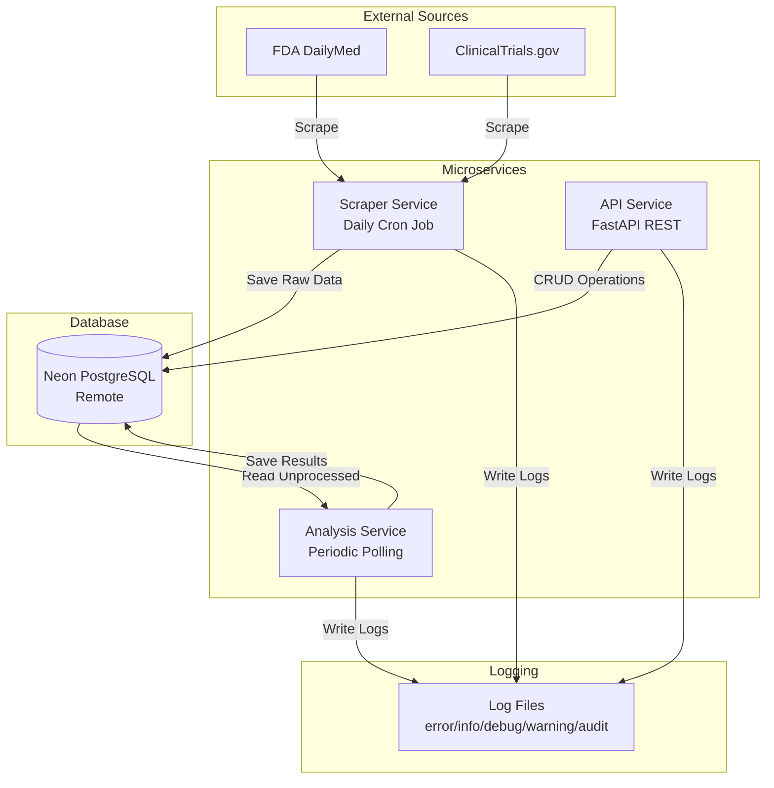

# Protego Health Backend System

A microservices-based system for scraping, analyzing, and exposing FDA drug labels and clinical trials data.

## Quick Start

> **📌 Working Directory:** All commands in this Quick Start section should be run from the project root directory

### 2. Start All Services

**From the project root directory** , run:

```bash
./scripts/start.sh
```

### Prerequisites

- Python 3.11+
- Docker & Docker Compose
- Access to Neon PostgreSQL database
- Environment variables configured (see `.env.example`)

### 1. Configure Environment

```bash
cp .env.example .env
# Edit .env with your Neon database credentials
```

This single command will:

- Build Docker images for all services
- Start all 3 services in parallel (Scraper, Analysis, API)
- Set up networking and logging

**Or use docker-compose directly (also from project root):**

```bash
docker-compose up --build -d
```

> **Important:** All commands in this guide should be run from the project root directory unless otherwise specified.

### 3. Verify Services Are Running

**From the project root directory:**

```bash
# Check service status
docker-compose ps

# View logs
docker-compose logs -f

# View specific service logs
docker-compose logs -f api
docker-compose logs -f scraper
docker-compose logs -f analysis
```

### 4. Test the API

**From the project root directory:**

```bash
./scripts/test-api.sh
```

**Or manually:**

- API Documentation: http://localhost:8000/docs
- Health Check: http://localhost:8000/health
- API Endpoints: http://localhost:8000/api/v1/scraping, http://localhost:8000/api/v1/analysis

### 5. Stop Services

**From the project root directory:**

```bash
docker-compose down
```

---

## Architecture Overview



## System Architecture

The system consists of three independent microservices that communicate via a shared PostgreSQL database:

### 1. Scraper Service

- **Purpose**: Scrapes public data from FDA DailyMed and ClinicalTrials.gov
- **Schedule**: Runs once daily at 2 AM UTC (configurable)
- **Output**: Raw scraped data saved to `scraping_results` table
- **Features**:
  - Factory pattern for scraper creation
  - Duplicate detection based on external_id
  - Error handling and retry logic
  - Comprehensive logging (5 log files)

### 2. Analysis Service

- **Purpose**: Analyzes scraped data for keywords and condition grouping
- **Schedule**: Polls database periodically for unprocessed data
- **Output**: Analysis results saved to `analysis_results` table
- **Features**:
  - Strategy pattern for different analysis algorithms
  - Keyword frequency analysis
  - Condition grouping analysis
  - Batch processing of unprocessed data
  - Comprehensive logging (5 log files)

### 3. API Service

- **Purpose**: Exposes REST API for accessing scraped and analyzed data
- **Framework**: FastAPI with OpenAPI/Swagger documentation
- **Endpoints**: Full CRUD operations for scraping and analysis results
- **Features**:
  - Request/response validation with Pydantic
  - Error handling middleware
  - Logging middleware with correlation IDs
  - Health check endpoint
  - Comprehensive logging (5 log files)

## Data Flow

### Scraping Flow

1. Scheduler triggers scraper service (daily at 2 AM UTC)
2. Factory creates appropriate scraper (FDA or Clinical Trials)
3. Scraper fetches data from external APIs
4. Data is validated and transformed using Pydantic models
5. Repository checks for duplicates (by external_id)
6. New data is saved to `scraping_results` table
7. All operations are logged to appropriate log files

### Analysis Flow

1. Analysis service polls database for unprocessed scraping results
2. Strategy pattern selects appropriate analyzer (keyword or condition)
3. Analyzer processes scraping result data
4. Analysis results are saved to `analysis_results` table in batch
5. Process continues until all unprocessed data is analyzed
6. All operations are logged

### API Flow

1. Client makes HTTP request to API service
2. Middleware logs request and adds correlation ID
3. Route handler validates input using Pydantic
4. Handler calls repository via dependency injection
5. Repository queries database using SQLAlchemy async
6. Response is returned with proper status code
7. Middleware logs response
8. Errors are caught and mapped to appropriate HTTP responses

## Technology Stack

- **Language**: Python 3.11+ with strict type hints
- **API Framework**: FastAPI
- **Validation**: Pydantic models
- **Database**: PostgreSQL (Neon remote)
- **ORM**: SQLAlchemy async + Alembic
- **Type Checking**: mypy (strict mode)
- **HTTP Client**: httpx (for scraping)
- **Scheduler**: APScheduler
- **Containerization**: Docker
- **Orchestration**: Kubernetes

## Design Patterns

The system implements multiple design patterns:

1. **Factory Pattern**: Scraper creation, logger creation
2. **Strategy Pattern**: Analysis algorithms (keyword, condition grouping)
3. **Repository Pattern**: Data access abstraction (all services)
4. **Dependency Injection**: Via ABC interfaces and constructor injection
5. **Builder Pattern**: Query construction, configuration objects
6. **Adapter Pattern**: External API integrations
7. **Decorator Pattern**: Middleware, validation, logging

## Logging System

Each service maintains 5 separate log files in its own `logs/` directory:

- `services/scraper/logs/error.log` - Error level logs only
- `services/scraper/logs/info.log` - Info level logs (operational events)
- `services/scraper/logs/debug.log` - Debug level logs (detailed debugging)
- `services/scraper/logs/warning.log` - Warning level logs
- `services/scraper/logs/audit.log` - Audit trail logs (security, access, data changes)

Same structure applies for `services/analysis/logs/` and `services/api/logs/`.

Logs use structured JSON format in production, plain text in development.

## Project Structure

```
/
├── services/
│   ├── scraper/          # Scraper service
│   │   └── logs/         # Scraper service logs
│   ├── analysis/         # Analysis service
│   │   └── logs/         # Analysis service logs
│   └── api/              # API service
│       └── logs/         # API service logs
├── shared/               # Shared code (types, constants, logging, patterns)
├── tests/                # Test files
├── migrations/           # Alembic database migrations
├── k8s/                  # Kubernetes manifests
├── scripts/              # Utility scripts
│   ├── start.sh         # Start all services
│   └── test-api.sh      # Test API endpoints
├── .env.example          # Environment variables template
├── docker-compose.yml    # Local development setup
└── README.md             # This file
```

## Local Development Setup (Alternative)

If you prefer to run services directly with Python instead of Docker:

### 1. Install Dependencies

```bash
pip install -e ".[dev]"
```

### 2. Run Database Migrations

```bash
alembic upgrade head
```

### 3. Run Services Manually

**Terminal 1: Scraper service**

```bash
cd services/scraper && python -m src.main
```

**Terminal 2: Analysis service**

```bash
cd services/analysis && python -m src.main
```

**Terminal 3: API service**

```bash
cd services/api && python -m src.main
```

## Kubernetes Deployment

### 1. Build Docker Images

```bash
docker build -t protego-scraper:latest -f services/scraper/Dockerfile .
docker build -t protego-analysis:latest -f services/analysis/Dockerfile .
docker build -t protego-api:latest -f services/api/Dockerfile .
```

### 2. Push to Container Registry

```bash
docker tag protego-scraper:latest <registry>/protego-scraper:latest
docker tag protego-analysis:latest <registry>/protego-analysis:latest
docker tag protego-api:latest <registry>/protego-api:latest

docker push <registry>/protego-scraper:latest
docker push <registry>/protego-analysis:latest
docker push <registry>/protego-api:latest
```

### 3. Update Kubernetes Manifests

Update image references in deployment files if using a different registry.

### 4. Create Secrets

```bash
kubectl create secret generic protego-secrets \
  --from-literal=DATABASE_URL='your-neon-db-connection-string'
```

### 5. Apply Manifests

```bash
kubectl apply -f k8s/configmap.yaml
kubectl apply -f k8s/secret.yaml
kubectl apply -f k8s/scraper-deployment.yaml
kubectl apply -f k8s/analysis-deployment.yaml
kubectl apply -f k8s/api-deployment.yaml
kubectl apply -f k8s/api-service.yaml
```

### 6. Verify Deployment

```bash
kubectl get pods
kubectl get services
kubectl logs -f deployment/protego-api
```

## API Endpoints

### Scraping Results

- `GET /api/v1/scraping` - List scraping results (with pagination)
- `GET /api/v1/scraping/{id}` - Get scraping result by ID
- `PUT /api/v1/scraping/{id}` - Update scraping result
- `DELETE /api/v1/scraping/{id}` - Delete scraping result

### Analysis Results

- `GET /api/v1/analysis` - List analysis results (with pagination)
- `GET /api/v1/analysis/{id}` - Get analysis result by ID
- `PUT /api/v1/analysis/{id}` - Update analysis result
- `DELETE /api/v1/analysis/{id}` - Delete analysis result

### Health

- `GET /health` - Health check endpoint

## Testing the System

### Quick System Test

1. **Start all services:**

   ```bash
   ./scripts/start.sh
   ```

2. **Test API endpoints:**

   ```bash
   ./scripts/test-api.sh
   ```

3. **Check service logs:**
   ```bash
   docker-compose logs -f
   ```

For detailed testing instructions, see [TESTING.md](./TESTING.md).

### Unit Tests (TODO)

```bash
# Run all tests
pytest

# Run with coverage
pytest --cov=services --cov=shared --cov-report=html

# Run specific service tests
pytest tests/scraper/
pytest tests/analysis/
pytest tests/api/
```

### Coverage Requirements

- Minimum 80% overall code coverage per service
- Minimum 90% coverage for business logic
- Minimum 85% coverage for repositories
- 100% coverage for error handling and validation

## Code Quality Standards

- **Type Safety**: Strict mypy configuration, no `any` types
- **File Size**: Maximum 300 lines per file
- **Constants**: All string literals in constants files
- **SOLID Principles**: Strictly enforced
- **Design Patterns**: Multiple patterns implemented
- **Error Handling**: Typed exception classes only
- **Documentation**: Google-style docstrings for all public APIs

## Design Trade-offs

1. **Database-only Communication**: Simpler than message queues, but creates tighter coupling to DB schema
2. **Remote Neon DB**: No local DB container needed, but requires internet connectivity
3. **Polling vs Events**: Analysis service polls DB - simple but less efficient than event-driven architecture
4. **Monorepo Structure**: Easier code sharing, but requires careful dependency management
5. **SQLAlchemy async**: Mature ORM with good type hints, but requires async/await throughout codebase
6. **Microservices vs Monolith**: Better scalability and separation, but more complex deployment

## Troubleshooting

### Service won't start

- Check environment variables in `.env`
- Verify database connection string
- Check logs in `services/<service_name>/logs/error.log`

### Database connection issues

- Verify Neon database is accessible
- Check connection string format
- Ensure SSL is properly configured

### Scraper not running

- Check scheduler configuration (cron expression)
- Verify `SCRAPER_ENABLED=true`
- Check scraper service logs

### API returning errors

- Check API service logs
- Verify database connectivity
- Check request format matches API schema

## Contributing

1. Follow strict coding standards (see PLAN.md)
2. All files must be under 300 lines
3. No string literals or magic numbers
4. Write tests for all new functionality
5. Maintain minimum 80% code coverage

## License

MIT
